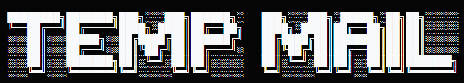

# TempMail V4 - Disposable Email Service 📧

<div align="center">
  
  

  [](https://github.com/mehmetkahya0/temp-mail/stargazers)
  [](https://github.com/mehmetkahya0/temp-mail/network/members)
  [](https://github.com/mehmetkahya0/temp-mail/issues)
  [](https://github.com/mehmetkahya0/temp-mail/blob/main/LICENSE)
  [](https://mehmetkahya0.github.io/temp-mail/)

  **Protect your privacy with premium instant disposable email addresses**

  [Live Demo](https://mehmetkahya0.github.io/temp-mail/) | [Report Bug](https://github.com/mehmetkahya0/temp-mail/issues) | [Request Feature](https://github.com/mehmetkahya0/temp-mail/issues)
</div>

> [!IMPORTANT]  
> ALL CODE FOR THIS WEBSITE IS COPYRIGHTED. YOU CANNOT USE THESE CODES AND OPEN ANOTHER WEBSITE IN THE SAME WAY. IT IS BEING TRACKED WITH VARIOUS TOOLS AND IF IT IS OPENED, A DMCA VIOLATION WILL BE SENT WITH MY LAWYER. SCANS ARE CARRIED OUT REGULARLY WITH VARIOUS TOOLS.
>
> PLEASE READ THE LICENSE

## 🎯 Overview

TempMail V4.0 is a premium, cutting-edge temporary email solution designed for privacy-conscious users. Generate up to 5 disposable email addresses simultaneously, enjoy organic visual aesthetics, use a lightning-fast keyboard-driven Command Palette, and organize incoming mail automatically using smart semantic tags.

Built entirely with pure high-performance Vanilla HTML5, CSS3, and JavaScript, TempMail V4.0 offers a highly responsive, modern glassmorphic interface with no registration or personal data required.

<div align="center">

  

</div>

## ✨ Features

<div align="center">
  
  
  
</div>

### 🎨 Visual & Aesthetic Excellence
*   **Aurora Drift Keyframes**: Smooth, non-banding decoupled background glow animations utilizing independent drift animations (translation, scaling, and rotation keys).
*   **Tactile Noise Grain Overlay**: SVG fractal film grain texture that diffuses the background color gradients, yielding a tactile, highly premium physical feel.
*   **Glassmorphic Card UI**: Elegant responsive layout with subtle borders, glowing active states, and fluid theme transitions.

### 📬 Multi-Mailbox Session Switching
*   **Tabbed Mailbox System**: Manage up to 5 active disposable email accounts simultaneously via a sleek tab bar.
*   **Auto-Migration & Caching**: Legacy session data is smoothly migrated to session arrays stored securely under `temp_mail_sessions_v4`. Inboxes, timers, and refresh parameters sync on tab switch.
*   **Capacity Guard**: Limits active sessions to 5, preventing browser bloat.

### ⌨️ Glassmorphic Command Palette (`Ctrl+K` / `Cmd+K`)
*   **Fuzzy Search Overlay**: Triggered globally with a quick keystroke.
*   **Full Keyboard Controls**: Navigate results using `Up` / `Down` arrows, execute commands with `Enter`, and dismiss the modal with `Esc`.
*   **Direct Operations**: Instantly copy email addresses, switch tabs, regenerate, clear inboxes, change languages, or toggle dark mode.

### 🏷️ Smart Highlight & Semantic Tagging
*   **Semantic Label Classifiers**: Real-time evaluation automatically highlights incoming messages based on semantic keyword analysis:
    *   `🔑 Verification` for OTP, verification links, activation keys, and password resets.
    *   `🔒 Security` for logins, logins notifications, and 2FA.
    *   `🧪 Testing` for trials, development sandboxes, and tests.
    *   `📣 Marketing` for newsletters, offers, and promotionals.
*   **Email Starring & Pinning**: Pin crucial emails with a golden star button that persists across visits (stored under `temp_mail_starred_ids`).
*   **Quick Filter Chips**: Filter the inbox dynamically on the fly between `All`, `⭐ Starred`, and `🔑 Verifications`.

---

## 🚀 Tech Stack

<div align="center">
  
  
  
  
  
  
  
</div>

*   **Frontend**: Pure HTML5 & CSS3 with HSL tailored variables, smooth CSS keyframes, and custom SVG filters.
*   **Logic**: Vanilla JavaScript (ES6) with local storage sync, custom event loops, and Keyboard Event processing.
*   **Icons**: Font Awesome 6.0 Free Suite.
*   **Localization**: Integrated instant TR/EN multi-lingual engine.
*   **API Service**: [Guerrilla Mail API](https://www.guerrillamail.com/) for high deliverability and secure operations.

---

## 🖥️ Live Demo

Experience TempMail V4 in action:

<div align="center">
  
  [](https://mehmetkahya0.github.io/temp-mail/)
  
</div>

---

## 🛠️ Installation & Setup

### Quick Start

1. **Clone the repository**
   ```bash
   git clone https://github.com/mehmetkahya0/temp-mail.git
   ```

2. **Navigate to the project directory**
   ```bash
   cd temp-mail
   ```

3. **Launch the local development environment**
   
   If you have Node.js installed, launch a local server for live updates:
   ```bash
   # Install Live Server globally
   npm install -g live-server
   
   # Start the server
   live-server
   ```
   
   Alternatively, you can open `index.html` directly in any web browser of your choice.

---

## ⌨️ Keyboard Shortcuts Sheet

TempMail V4 supports rich shortcuts out of the box:

| Shortcut | Action | Description |
|---|---|---|
| `Ctrl + K` or `Cmd + K` | **Command Palette** | Open the glassmorphic fuzzy search search menu |
| `R` | **Refresh** | Fetch incoming emails manually |
| `N` | **New Address** | Generate a fresh email address in the active tab |
| `C` | **Copy Address** | Copy the active email address to your clipboard |
| `/` | **Focus Search** | Jump cursor straight into the inbox search field |
| `?` | **Help Center** | Show the shortcuts overlay guide |
| `Esc` | **Close/Dismiss** | Close active modals, overlays, or remove search focus |

---

## 📂 Project Structure

```
temp-mail/
├── css/
│   └── style.css              # Main stylesheet (V4 layouts, animations, dark mode variables)
├── js/
│   ├── api.js                 # Complete V4 functional API and event bindings
│   ├── config.js              # Environment settings, constants, and API base configurations
│   └── theme.js               # Visual dark-mode preference parser
├── images/
│   ├── banner.png             # Project banner
│   ├── header.png             # Feature diagram
│   └── temp-mail-icon.png     # Site favicon/icon
├── privacy/
│   ├── privacy.css            # Privacy policy stylesheet
│   └── privacy.html           # Full privacy declarations page
├── index.html                 # Premium V4 layout container
├── manifest.json              # Web Application Manifest config
├── robots.txt                 # Search indexing parameters
├── sitemap.xml                # Sitemap definition
├── LICENSE                    # Security & licensing details
└── README.md                  # Project repository documentation
```

---

## ⚙️ Core V4 Components

### Session Caching & Array Switching
```javascript
// Switches between multiple mailbox tabs, restoring cache and known IDs in active memory
function switchMailbox(index) {
    saveCurrentSession();
    activeSessionIndex = index;
    const session = activeSessions[index];
    if (session) {
        currentEmail = session.email;
        sessionId = session.sessionId;
        knownMailIds = new Set(session.knownIds || []);
        // LocalStorage sync
        setStored(CONFIG.EMAIL_KEY, currentEmail);
        setStored(CONFIG.SESSION_KEY, sessionId);
        ...
        renderMailboxTabs();
        startSessionTimer();
        refreshMail();
    }
}
```

### Smart Tag Regex Pattern Matching
```javascript
// Automatically classifies incoming emails by examining Subject and From strings
function detectEmailTags(subject, from) {
    const s = (subject || '').toLowerCase();
    const f = (from || '').toLowerCase();
    
    if (s.includes('verify') || s.includes('code') || s.includes('otp') || s.includes('activation') || s.includes('confirm') || s.includes('onay')) {
        return { class: 'verification', label: t('tag_verification'), icon: 'fa-key' };
    }
    ...
}
```

---

## 📜 License

This project is licensed under the Special License with specific commercial restrictions - see the [LICENSE](LICENSE) file for details.

**Important:** While you can use this project for personal and educational purposes, commercial use requires explicit permission from the project author.

---

## 👤 Author

<div align="center">
  <a href="https://github.com/mehmetkahya0">
    
    <br />
    <b>Mehmet Kahya</b>
  </a>
</div>
<br />
<div align="center">
  
  [](https://github.com/mehmetkahya0)
  [](https://linkedin.com/in/mehmet-kahya-0861a4286)
  [](mailto:mehmetkahyakas5@gmail.com)
  
</div>

---

## 👏 Acknowledgments

*   [Guerrilla Mail](https://www.guerrillamail.com/) for their robust temporary email API.
*   [Font Awesome](https://fontawesome.com/) for their comprehensive icon library.
*   All contributors who have helped improve and test this project.

---

<div align="center">
  
  ⚠️ **Disclaimer:** This project is purely for educational purposes. We do not allow illegal activities to be performed using this project and are not responsible for any incidents that may occur. Use it legally and responsibly.
  
</div>
